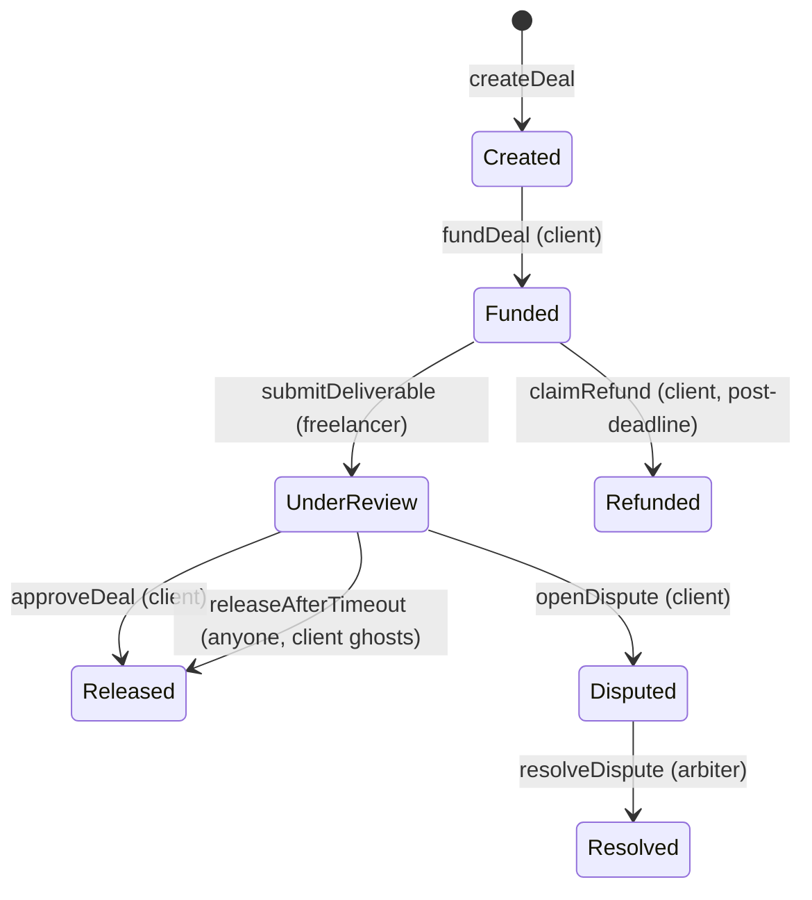

# Handshake

Payment-protected handoffs for informal digital work, on Monad testnet (chain id `10143`).

**Live:** https://hand-shake-theta.vercel.app/
**Hackathon:** BuildAnything — Spark

> The client cannot lose their money, and the freelancer cannot lose control of the final work.

A deal that today lives in a Discord DM — $125 for a brand kit, $40 for a logo touch-up — becomes a real escrow contract with encrypted delivery, deadlines enforced in code, and an auto-release path for when the client ghosts. No platform in the middle, no cut taken. The code holds the risk for both sides.

## Contents

- [The problem](#the-problem)
- [How a deal moves](#how-a-deal-moves)
- [Try the demo](#try-the-demo)
- [The technical bet](#the-technical-bet)
- [Run it locally](#run-it-locally)
- [Repo layout](#repo-layout)
- [What's not wired yet](#whats-not-wired-yet)
- [Built with](#built-with)
- [License](#license)

## The problem

Small digital deals have a trust problem. Either the client pays upfront and prays the work lands, or the freelancer ships first and prays the invoice gets paid. One side always eats the downside.

Handshake moves the risk into the contract:

- **Client** locks USDC in escrow before the freelancer ships — can't lose money to a ghost.
- **Freelancer** encrypts the file in-browser and commits only its hash onchain — can't lose control of the original. The key releases only when the contract says so.
- **Client ghosts** → anyone can call `releaseAfterTimeout`; the freelancer gets paid once the review window closes.
- **Freelancer ghosts** → the client calls `claimRefund` after the deadline; full escrow returned.
- **Real dispute** → the arbiter resolves it: release, refund, or a 50/50 split.

## How a deal moves



All functions live on `HandshakeEscrow` — full Solidity in [`contracts/src/HandshakeEscrow.sol`](contracts/src/HandshakeEscrow.sol).

| Function | Who | Transition | In UI |
|---|---|---|---|
| `createDeal(...)` | client | → `Created` | yes |
| `fundDeal(id)` | client | `Created` → `Funded` | yes |
| `submitDeliverable(id, h)` | freelancer | `Funded` → `UnderReview` | yes |
| `approveDeal(id)` | client | `UnderReview` → `Released` | yes |
| `openDispute(id)` | client | `UnderReview` → `Disputed` | yes |
| `resolveDispute(id, o)` | arbiter | `Disputed` → `Resolved` | preview |
| `claimRefund(id)` | client | `Funded` → `Refunded` | preview |
| `releaseAfterTimeout(id)` | anyone | `UnderReview` → `Released` | preview |

`createDeal` args: `(freelancer, arbiter, amount, deadline, reviewWindow)`

The happy path — create → fund → encrypt & submit → approve → unlock — is fully wired end to end. The edge cases (dispute, refund, timeout) are deployed and callable; the timeline page renders them as clearly labeled state previews showing the function and transition, not faked as executed.

## Try the demo

Needs two MetaMask accounts funded on Monad testnet — one for the client, one for the freelancer. Test MON: https://testnet.monad.xyz/faucet

1. **Client** — open the [live demo](https://hand-shake-theta.vercel.app/), sign in, pick *Client*, sign the SIWE message.
2. **Client** — create a deal: freelancer address, amount `125`, review window `48h`, deadline `7d`. *Create deal* (2 txs).
3. **Client** — on `/deal/0`, click *Fund 125 USDC*. Pill flips to `Funded`.
4. **Freelancer** — switch MetaMask, sign in as *Freelancer*, open the deal link.
5. **Freelancer** — *Encrypt & submit deliverable*, pick any file. The browser generates an AES-GCM 256 key, encrypts in memory, uploads ciphertext, submits the hash onchain. Pill flips to `Under review`.
6. **Client** — switch back, refresh `/deal/0`, click *Approve & release*. Contract pays the freelancer, emits `Released`.
7. **Client** — click *Unlock original*. The key API verifies onchain state, returns the key, the browser decrypts — download the byte-identical original.
8. **Either** — open `/timeline/0` for every event the contract emitted, each with a real MonadVision tx link.

## The technical bet

The trust boundary is the contract. Everything else is plumbing.

```
onchain   HandshakeEscrow — the trust boundary
          deal state, parties, amount, deadlines, ciphertext hash, outcome events
          nothing else

offchain  the file itself       encrypted, in Vercel Blob
          the AES key           gated store
          IV / filename / size  sidecar metadata
```

The trust gate: `/api/key` reads `HandshakeEscrow.getState(dealId)` on every request and returns the AES key only when the contract reports `state == Released`. A malicious client can hit the endpoint with any deal id — they only ever get a key for a deal the contract has actually released.

The freelancer keeps control of the original because the plaintext never leaves their browser: only the ciphertext goes to storage, and only its hash goes onchain. Until the contract says `Released`, the key stays locked.

## Run it locally

**Prerequisites**
- Node 20+ (built and tested on Node 24)
- MetaMask configured for Monad testnet — chain id `10143`, RPC `https://testnet-rpc.monad.xyz`

**Frontend only** (fastest — contracts are already deployed)

```bash
cd web
npm install
npm run dev
# open http://localhost:3000
```

**Full stack** (contracts + frontend, requires Foundry)

```bash
cd contracts
forge install         # pulls OpenZeppelin
forge build
```

Deploy is already done. To redeploy:

```bash
# 1. Fund a wallet from https://testnet.monad.xyz/faucet
# 2. forge script script/Deploy.s.sol --rpc-url https://testnet-rpc.monad.xyz \
#      --broadcast --private-key $PRIVATE_KEY --slow
# 3. Update web/lib/contract.ts with the new addresses

cd ../web
npm install
npm run dev
```

**Environment variables** — set in `web/.env.local` (or Vercel project settings for production):

```env
BLOB_READ_WRITE_TOKEN=vercel_blob_xxxxxx   # from https://vercel.com/dashboard/stores
```

The frontend runs without `BLOB_READ_WRITE_TOKEN` — landing, create, and deal-view all work. Only the encrypted-handoff upload (demo step 5) and the key-release unlock (step 7) need it.

## Repo layout

```
contracts/         Foundry — Solidity (HandshakeEscrow.sol + MockUSDC.sol)
web/                Next.js 16 App Router + wagmi v3 + viem + Framer Motion
  app/              pages + API routes (upload, key, key/store, blob/*)
  components/       Topbar, ConnectButton, EscrowOrbit, motion/
  lib/              monad.ts, contract.ts (ABIs + addresses), crypto.ts
```

Full file-by-file map: [`implementation.md`](implementation.md).

## What's not wired yet

- `resolveDispute`, `claimRefund`, `releaseAfterTimeout` are deployed and callable from a script or block explorer, but the UI only renders them as state previews in the timeline. Real UI buttons are the natural next step.
- The arbiter role is enforced in the contract (`resolveDispute`'s caller must match `deal.arbiter`), but there's no arbiter screen yet — the demo defaults the arbiter to the client's own address.
- The key-release API stores keys in Vercel Blob at a deterministic path. Production should use a KMS or DB with per-deal isolation.
- The session is a UI preference, not a security boundary — the escrow contract is. A production system would issue a server-side session token after SIWE verification.

## Built with

**Onchain** — Monad testnet (chain id `10143`), Foundry, OpenZeppelin (ERC20, SafeERC20, ReentrancyGuard)
**Frontend** — Next.js 16 (App Router), React 19 + TypeScript, wagmi v3 + viem, Framer Motion + Lenis
**Offchain storage / crypto** — Vercel Blob (ciphertext + key + sidecar), Web Crypto API (AES-GCM 256, in-browser)
**Toolchain** — monskills (Monad scaffold + verify — MonadVision and Monadscan in one call)

## License

MIT
